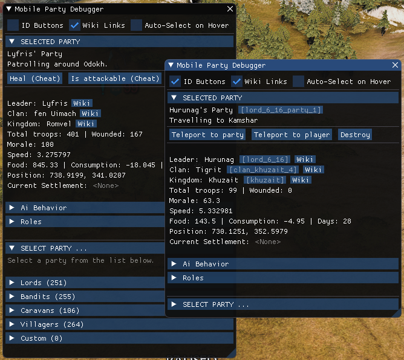
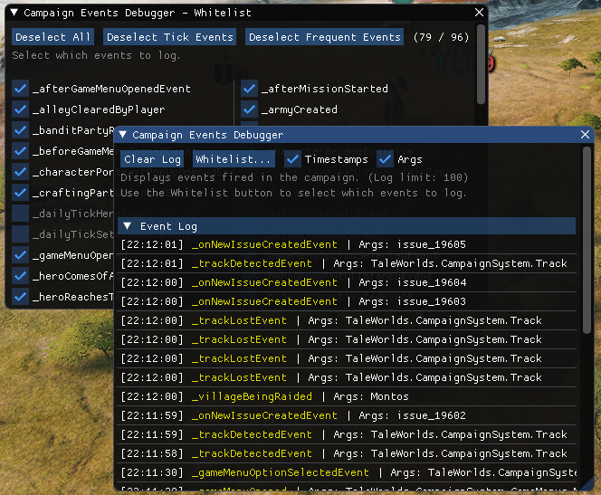

# Modding DevKit by Prophet ⚙️

*Modding & debug toolkit for Mount & Blade II: Bannerlord*

---

## 🧰 Overview

**Modding DevKit** is a **developer toolkit and debugging suite** built to streamline the modding workflow for
*Mount & Blade II: Bannerlord*.  
This mod provides in-game tools for testing, inspecting, and tweaking game systems in real
time.

---

## ⚙️ Features

- 🧩 **Debug windows** for different systems
- 🪶 **Entity inspectors** (parties, missions, agents, etc.)
- 🧰 **Custom utility buttons and actions** for faster testing
- 🔧 **Fixed UI "Show area" view** - Accessed via `ui.set_screen_debug_information_enabled True`

---

## 🚀 Installation

1. Download the latest release from GitHub.
2. Extract the folder into your Bannerlord installation directory: `Mount & Blade II Bannerlord/Modules/`
3. Enable **Modding DevKit** in the game launcher. (Last in load order)

---

## 🧪 Usage

- To open the **DevKit Manager Menu**
  - Press **`F1`** (can be changed in settings).
  - Or, run `devkit.manager` in the in-game console.
- To open specific debug windows, use the following hotkeys:
  - **`F2`** - Mobile Party Debugger
  - **`F3`** - Campaign Events Debugger
- Use `Shift` + window hotkey to open new instance of the window.
- Use the available windows and tools to inspect game state and test features.

---

## Previews

Mobile Party Debugger <code>(F2)</code>

Campaign Events Debugger <code>(F3)</code>

